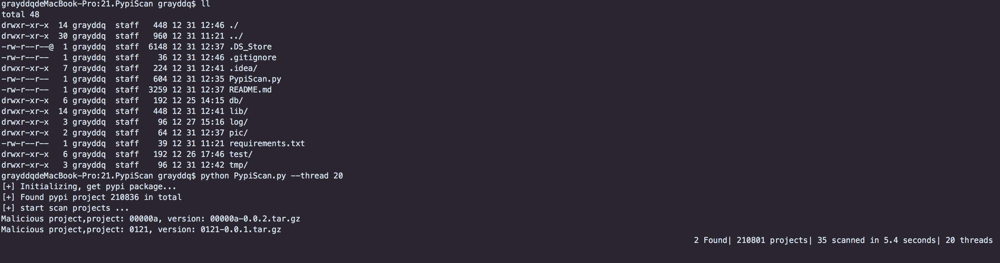

# PypiScan 0.1

这个脚本主要提供对pypi供应链的源头进行安全扫描研究，扫描并发现未知的恶意包情况。

## 作者 ##

咚咚呛 

如有其他建议，可联系微信280495355

## 技术细节 ##
技术细节如下

	1、脚本采取多线程方式爬取pypi所有包信息，默认10个线程，建议线程100+，加快扫描速度。
	2、每个项目包含多个版本包，releases包存在两种类型，whl和tar，whl类型实质为zip压缩。
	3、由于文件数量过大，硬盘存储有限，故采取下载/扫描完毕后会删除原始包，但会保存恶意文件到指定目录。
	4、扫描以静态扫描为住，扫描特征行包括：网络链接行为、特定文件操作、命令执行行为、特定编码行为
	5、作者执行了一次全量扫描，项目数量：21W+、包数量：150W+，用时10天+，目前误报较多，脚本主要用于研究使用，如要生产环境使用，请识别规则

## 程序使用 ##

> root# <kbd>git clone https://github.com/grayddq/PypiScan.git</kbd>
>
> root# <kbd>cd PypiScan</kbd>
>
> root# <kbd>sudo pip install -r requirements.txt</kbd>
>
> root# <kbd>python python PypiScan.py  --thread 100</kbd>

## 运行截图 ##

## 历史风险参考 ##

历史pypi恶意包

	https://snyk.io/vuln/SNYK-PYTHON-JEILYFISH-536726
	https://snyk.io/vuln/SNYK-PYTHON-PYTHON3DATEUTIL-536644
	https://snyk.io/vuln/SNYK-PYTHON-LIBARI-460155
	https://snyk.io/vuln/SNYK-PYTHON-LIBPESH-460156
    https://snyk.io/vuln/SNYK-PYTHON-LIBPESHNX-460157
    https://snyk.io/vuln/SNYK-PYTHON-DAJNGO-72531
    https://snyk.io/vuln/SNYK-PYTHON-DIANGO-72529
    https://snyk.io/vuln/SNYK-PYTHON-DJAGO-72530
    https://snyk.io/vuln/SNYK-PYTHON-MYBIUBIUBIU-72532
    https://snyk.io/vuln/SNYK-PYTHON-PKGUTIL-72527
    https://snyk.io/vuln/SNYK-PYTHON-SMPLEJSON-72526
    https://snyk.io/vuln/SNYK-PYTHON-TIMEIT-72528
    https://snyk.io/vuln/SNYK-PYTHON-COLOURAMA-72537
    https://snyk.io/vuln/SNYK-PYTHON-PYCONAUFUNTIMES-72536
    https://snyk.io/vuln/SNYK-PYTHON-DJANGA-72533
    https://snyk.io/vuln/SNYK-PYTHON-EASYINSTALL-72534
    https://snyk.io/vuln/SNYK-PYTHON-LIBPESHKA-72535
    https://snyk.io/vuln/SNYK-PYTHON-SSHDECORATE-40786
    https://snyk.io/vuln/SNYK-PYTHON-ACQUSITION-40662
    https://snyk.io/vuln/SNYK-PYTHON-APIDEVCOOP-40663
    https://snyk.io/vuln/SNYK-PYTHON-BZIP-40664
    https://snyk.io/vuln/SNYK-PYTHON-CRYPT-40665
    https://snyk.io/vuln/SNYK-PYTHON-DJANGOSERVER-40666
    https://snyk.io/vuln/SNYK-PYTHON-PWD-40667
    https://snyk.io/vuln/SNYK-PYTHON-SETUPTOOLS-40668
    https://snyk.io/vuln/SNYK-PYTHON-TELNET-40669
    https://snyk.io/vuln/SNYK-PYTHON-URLIB3-40670
    https://snyk.io/vuln/SNYK-PYTHON-URLLIB-40671

文章参考链接：
    
    https://github.com/dateutil/dateutil/issues/984
    https://blog.reversinglabs.com/blog/suppy-chain-malware-detecting-malware-in-package-manager-repositories
    https://medium.com/@bertusk/detecting-cyber-attacks-in-the-python-package-index-pypi-61ab2b585c67
    https://medium.com/@bertusk/cryptocurrency-clipboard-hijacker-discovered-in-pypi-repository-b66b8a534a8
    https://www.bleepingcomputer.com/news/security/backdoored-python-library-caught-stealing-ssh-credentials/
    https://www.bleepingcomputer.com/news/security/ten-malicious-libraries-found-on-pypi-python-package-index/
